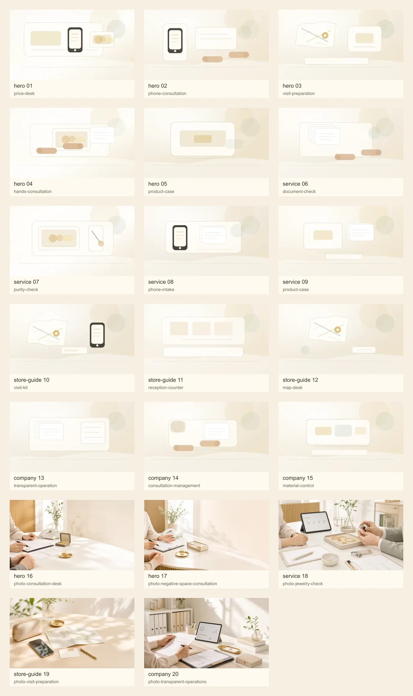
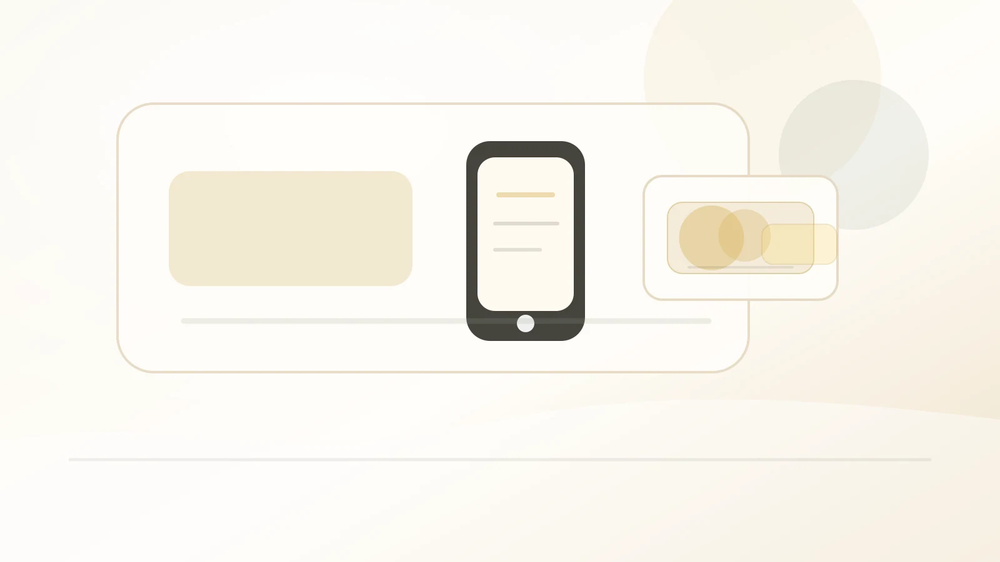
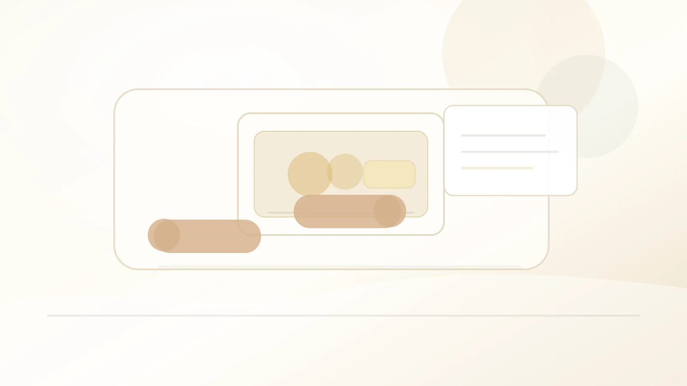
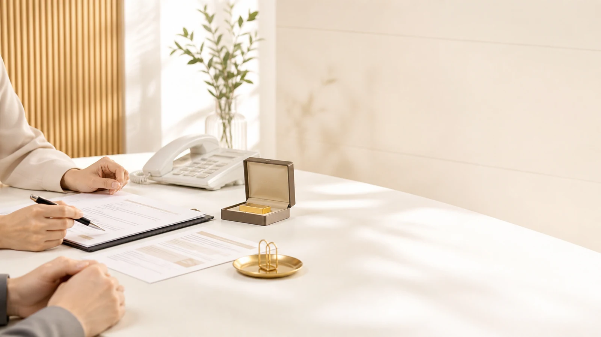
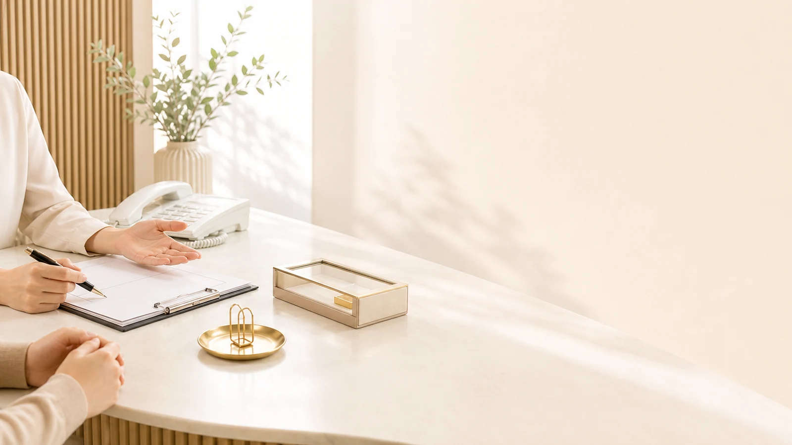
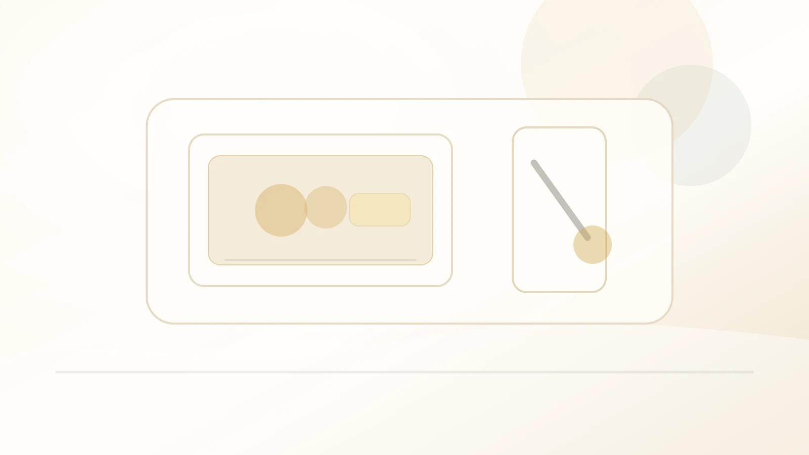
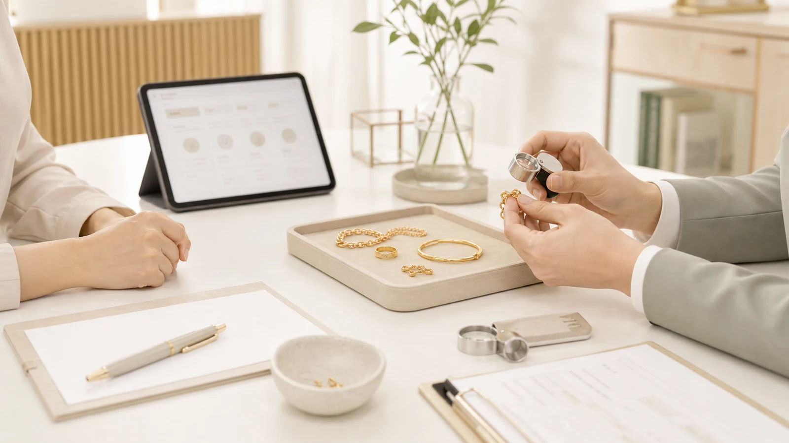
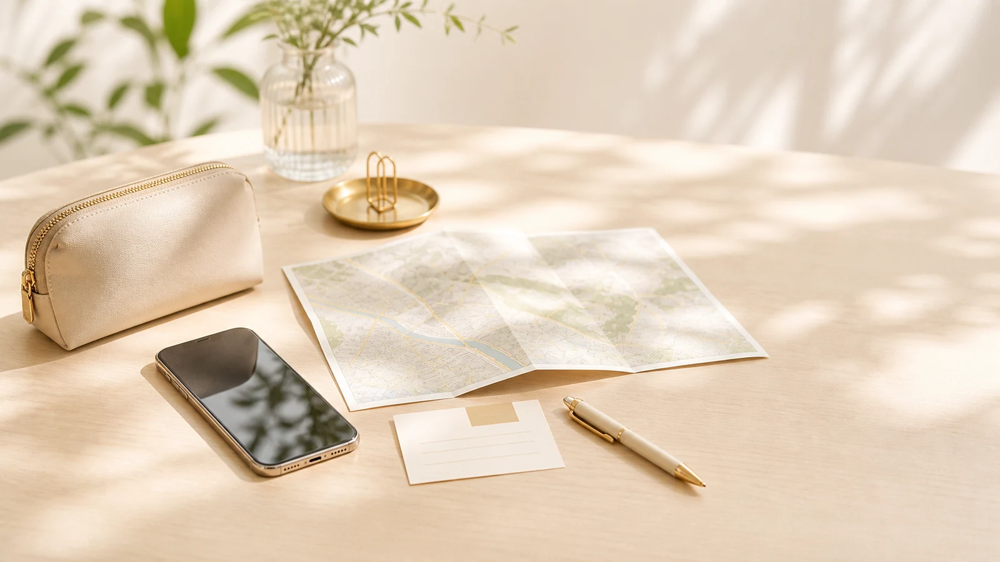

# KCG Candidate Image Preview - 2026-05-17

Status: `candidate_preview` only. These assets are not approved and are not connected to operational pages.

## Design Brief

- Product goal: replace dark/repetitive consultation, company, store-guide, and hero visuals with brighter KCG-safe candidate directions.
- Target user moment: fast trust check before calling or visiting KCG.
- Visual thesis: bright white/warm beige/soft gold consultation desks with practical objects, side-angle hands, no black background, no casino/luxury mood, and no fake certificates.
- Non-goals: no product SKU proof, no actual staff/customer/store claim, no prices, no payment/trading behavior, no search/noindex change.

## Approval Rule

- All files remain under `public/assets/generated/candidates/`.
- JSON manifest entries are `approval_status: candidate` and `allowed_usage: ["candidate_preview"]` only.
- Codex must not move these to `approved` or connect them to operational pages without human approval.

## Candidate Summary

| category | count | scene diversity check |
| --- | ---: | --- |
| hero | 7 | max scene share 14%; price-desk 1, phone-consultation 1, visit-preparation 1, hands-consultation 1, product-case 1, photo-consultation-desk 1, photo-negative-space-consultation 1 |
| service | 5 | max scene share 20%; document-check 1, purity-check 1, phone-intake 1, product-case 1, photo-jewelry-check 1 |
| store-guide | 4 | max scene share 25%; visit-kit 1, reception-counter 1, map-desk 1, photo-visit-preparation 1 |
| company | 4 | max scene share 25%; transparent-operation 1, consultation-management 1, material-control 1, photo-transparent-operations 1 |

## Preview Contact Sheet

## hero

### candidate-hero-price-desk-20260517-01

- file_path: `/assets/generated/candidates/hero/kcg-candidate-hero-20260517-01.webp`
- image_source_type: `C`
- approval_status: `candidate`
- allowed_usage: `candidate_preview`
- scene_type: `price-desk`
- checksum: `sha256:4eab38777ecde6d12a4b69461fa8443c6d6c59488f6dba99b70f34c3229eed1f`
- QA notes: Hero expansion candidate. Bright price-desk mood with no embedded price text and no fake certificate.

### candidate-hero-phone-consult-20260517-02

- file_path: `/assets/generated/candidates/hero/kcg-candidate-hero-20260517-02.webp`
- image_source_type: `E`
- approval_status: `candidate`
- allowed_usage: `candidate_preview`
- scene_type: `phone-consultation`
- checksum: `sha256:f64affdf91768410d8cc7f38bc2bcf77812d22023a126121118585c612c44e8e`
- QA notes: Virtual-people candidate. Face is not a proof point; no name tag, title, testimonial, or staff claim.

### candidate-hero-visit-prep-20260517-03

- file_path: `/assets/generated/candidates/hero/kcg-candidate-hero-20260517-03.webp`
- image_source_type: `C`
- approval_status: `candidate`
- allowed_usage: `candidate_preview`
- scene_type: `visit-preparation`
- checksum: `sha256:062a32554c7a8f7b94a127d83c1577d3f50ea71e549d05c0ab8368f8de234614`
- QA notes: Hero/store-guide bridge candidate for visit preparation without fake storefront.

### candidate-hero-consultation-table-20260517-04

- file_path: `/assets/generated/candidates/hero/kcg-candidate-hero-20260517-04.webp`
- image_source_type: `E`
- approval_status: `candidate`
- allowed_usage: `candidate_preview`
- scene_type: `hands-consultation`
- checksum: `sha256:fab7834652b8eb8837a7a5cc568d79a1af7b8bd03ff266f927c6f90ce094ba67`
- QA notes: Virtual consultation atmosphere candidate with hands and documents, no fake appraisal certificate.

### candidate-hero-product-case-20260517-05

- file_path: `/assets/generated/candidates/hero/kcg-candidate-hero-20260517-05.webp`
- image_source_type: `C`
- approval_status: `candidate`
- allowed_usage: `candidate_preview`
- scene_type: `product-case`
- checksum: `sha256:3c1a6f99a24655a0c7e96e709e54b01ab6d18224e5c0c20c4acf64662c34fda9`
- QA notes: Hero expansion candidate for product consultation, not an individual product proof image.

### candidate-hero-photo-consultation-20260517-06

- file_path: `/assets/generated/candidates/hero/kcg-candidate-hero-photo-20260517-06.webp`
- image_source_type: `E`
- approval_status: `candidate`
- allowed_usage: `candidate_preview`
- scene_type: `photo-consultation-desk`
- checksum: `sha256:2db67ea628c9165bff0b076a9ab2282696c4077984acf3dd298b3ad70f4a03e2`
- QA notes: Built-in image generation output. Candidate only; includes no readable price text, staff claim, or exact SKU proof.

### candidate-hero-photo-negative-space-20260517-07

- file_path: `/assets/generated/candidates/hero/kcg-candidate-hero-photo-20260517-07.webp`
- image_source_type: `E`
- approval_status: `candidate`
- allowed_usage: `candidate_preview`
- scene_type: `photo-negative-space-consultation`
- checksum: `sha256:f64fb4d934f71c8b8529f61e8203dd30253256f1708761c1f6a845cf2f9d4bc3`
- QA notes: Built-in image generation output for hero slide expansion. Candidate only; not operationally connected.

## service

### candidate-service-document-check-20260517-01

- file_path: `/assets/generated/candidates/service/kcg-candidate-service-20260517-01.webp`
- image_source_type: `D`
- approval_status: `candidate`
- allowed_usage: `candidate_preview`
- scene_type: `document-check`
- checksum: `sha256:0f02ea0e4ca41c022ef9bb0f9f64b5b97a07c62d79d4f4b00e788239dadc625d`
- QA notes: Service candidate for consultation process and intake guidance.

### candidate-service-purity-check-20260517-02

- file_path: `/assets/generated/candidates/service/kcg-candidate-service-20260517-02.webp`
- image_source_type: `D`
- approval_status: `candidate`
- allowed_usage: `candidate_preview`
- scene_type: `purity-check`
- checksum: `sha256:e7bd72ede27fe16023c91d71f0337ac3107d0e24be8e67613f85077b1257b283`
- QA notes: Service candidate for inspection flow. No exact product or fake assay result.

### candidate-service-phone-intake-20260517-03

- file_path: `/assets/generated/candidates/service/kcg-candidate-service-20260517-03.webp`
- image_source_type: `E`
- approval_status: `candidate`
- allowed_usage: `candidate_preview`
- scene_type: `phone-intake`
- checksum: `sha256:f9302f55dc5f1655e677089d3665bc3c57e64907d05db5d2323d134e9941c59b`
- QA notes: Virtual-people service candidate. No actual employee implication.

### candidate-service-product-case-20260517-04

- file_path: `/assets/generated/candidates/service/kcg-candidate-service-20260517-04.webp`
- image_source_type: `D`
- approval_status: `candidate`
- allowed_usage: `candidate_preview`
- scene_type: `product-case`
- checksum: `sha256:3958d5171109fbe5ac29901a10db48be4f35dbaa9b66fb614d7514ef43e05f5d`
- QA notes: Service candidate for packaging/intake step with non-SKU product case.

### candidate-service-photo-jewelry-check-20260517-05

- file_path: `/assets/generated/candidates/service/kcg-candidate-service-photo-20260517-05.webp`
- image_source_type: `D`
- approval_status: `candidate`
- allowed_usage: `candidate_preview`
- scene_type: `photo-jewelry-check`
- checksum: `sha256:6bc3a2321aaa65d5c42d46b96bb8543a0da9dc497eddc55e095b408c2cd9c457`
- QA notes: Built-in image generation output for service replacement candidate. Candidate only; tiny interface details are treated as non-readable background texture.

## store-guide

### candidate-store-guide-visit-kit-20260517-01

- file_path: `/assets/generated/candidates/store-guide/kcg-candidate-store-guide-20260517-01.webp`
- image_source_type: `C`
- approval_status: `candidate`
- allowed_usage: `candidate_preview`
- scene_type: `visit-kit`
- checksum: `sha256:97edd2e10507e752543976ca408c3e031fcf645b6934de6a6460c36568b6bc6f`
- QA notes: Store-guide candidate for what to prepare before visiting.

### candidate-store-guide-counter-20260517-02

- file_path: `/assets/generated/candidates/store-guide/kcg-candidate-store-guide-20260517-02.webp`
- image_source_type: `C`
- approval_status: `candidate`
- allowed_usage: `candidate_preview`
- scene_type: `reception-counter`
- checksum: `sha256:ad6c839ff14a18d7df70572a31a55f1b6d6a59604fa78a3bf9e64d9beaf617f7`
- QA notes: Store-guide candidate. Generic visit guidance, not a real store interior claim.

### candidate-store-guide-map-desk-20260517-03

- file_path: `/assets/generated/candidates/store-guide/kcg-candidate-store-guide-20260517-03.webp`
- image_source_type: `C`
- approval_status: `candidate`
- allowed_usage: `candidate_preview`
- scene_type: `map-desk`
- checksum: `sha256:d1a8d2cfa1977d4b945fa7bc657e512aa253222db941f95dc89e8ce3436c0a4c`
- QA notes: Store-guide candidate for location-prep mood. No fake map text.

### candidate-store-guide-photo-visit-prep-20260517-04

- file_path: `/assets/generated/candidates/store-guide/kcg-candidate-store-guide-photo-20260517-04.webp`
- image_source_type: `C`
- approval_status: `candidate`
- allowed_usage: `candidate_preview`
- scene_type: `photo-visit-preparation`
- checksum: `sha256:fa3032ce3f96a41b6678279edf2afb498a881cfc29eece1a1453ab9407922e60`
- QA notes: Built-in image generation output for store-guide replacement candidate. Candidate only; no operational link.

## company

### candidate-company-transparent-operation-20260517-01

- file_path: `/assets/generated/candidates/company/kcg-candidate-company-20260517-01.webp`
- image_source_type: `C`
- approval_status: `candidate`
- allowed_usage: `candidate_preview`
- scene_type: `transparent-operation`
- checksum: `sha256:8a2332ce560e94c19ea0f857c0ef90af3bf1f0dcf72c9c18752171c160d01774`
- QA notes: Company candidate for transparent operation, avoiding goldbar wallpaper.

### candidate-company-consultation-management-20260517-02

- file_path: `/assets/generated/candidates/company/kcg-candidate-company-20260517-02.webp`
- image_source_type: `E`
- approval_status: `candidate`
- allowed_usage: `candidate_preview`
- scene_type: `consultation-management`
- checksum: `sha256:f47c3703c679f025d1d1b28ed7fc9eb84919d0e5c85c926a60e7ef5aee94be92`
- QA notes: Virtual-people company candidate. No employee, customer, or expert guarantee claim.

### candidate-company-material-control-20260517-03

- file_path: `/assets/generated/candidates/company/kcg-candidate-company-20260517-03.webp`
- image_source_type: `C`
- approval_status: `candidate`
- allowed_usage: `candidate_preview`
- scene_type: `material-control`
- checksum: `sha256:76716d61647851840e340335eb0ca0967e04307f181d05da6a9f8ce3d7fdb335`
- QA notes: Company candidate for controlled, practical operation. No casino/luxury effect.

### candidate-company-photo-operations-20260517-04

- file_path: `/assets/generated/candidates/company/kcg-candidate-company-photo-20260517-04.webp`
- image_source_type: `E`
- approval_status: `candidate`
- allowed_usage: `candidate_preview`
- scene_type: `photo-transparent-operations`
- checksum: `sha256:fdce87c15301707ae5829f4504ab5af1514c830b1c18810092112166d148c91d`
- QA notes: Built-in image generation output for company replacement candidate. Candidate only; no approval implied.

## QA Review Notes

- Bright background: pass for all generated candidates.
- Black background: none.
- Fake text/certificates: illustration candidates contain no rendered Korean/English text; photo-style candidates have no intentionally readable text, certificate, stamp, or license design.
- Virtual people: only side-angle/hand/shoulder compositions; no staff name, title, testimonial, or face-close proof point.
- Repetition: service, store-guide, company, and hero batches use distinct scene types; no type exceeds 40% within these generated sets.
- Operational connection: none. `npm run audit:site` must fail if any candidate path is referenced by operational source.
